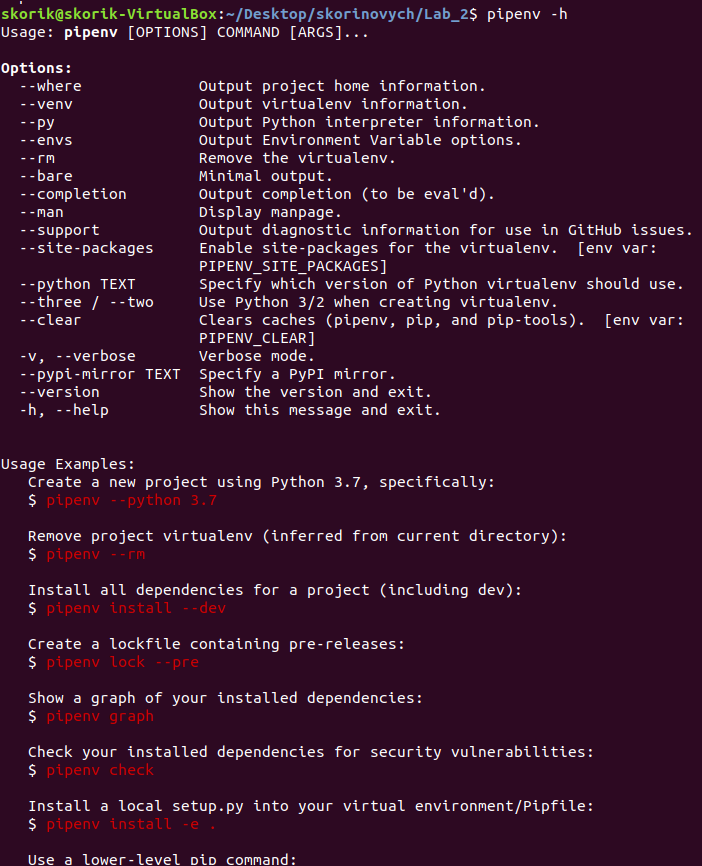
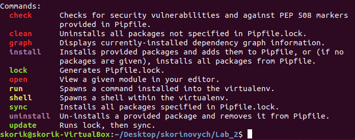
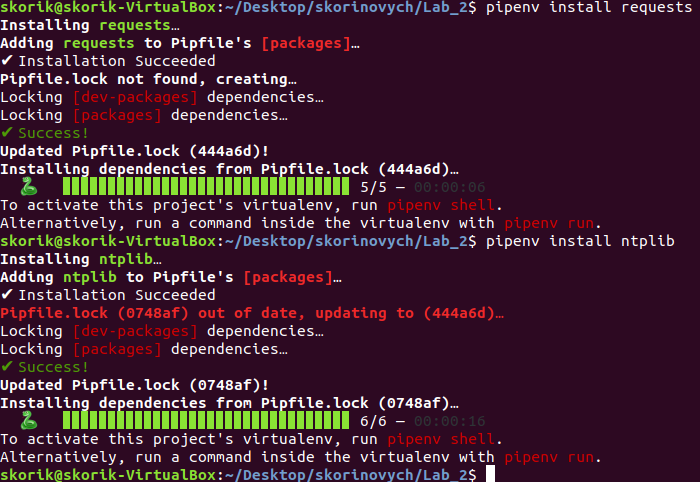
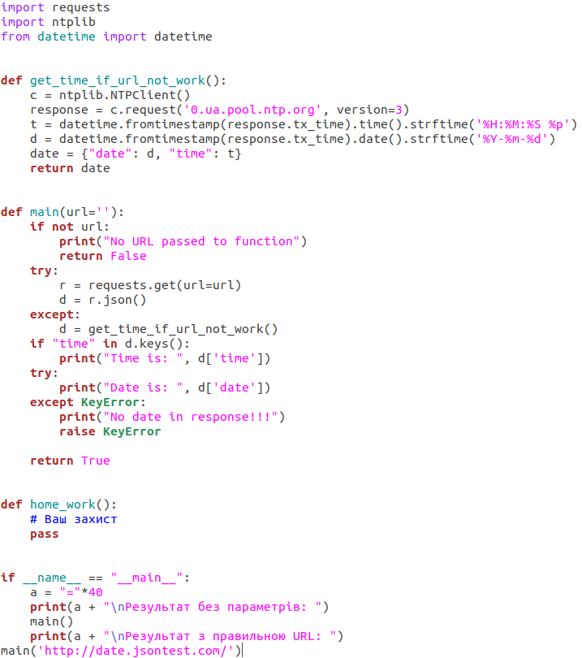
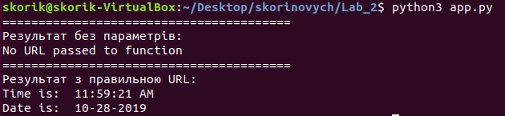
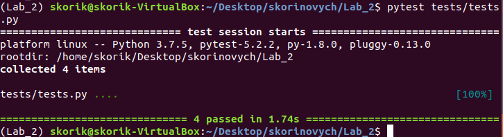
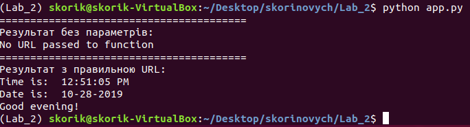
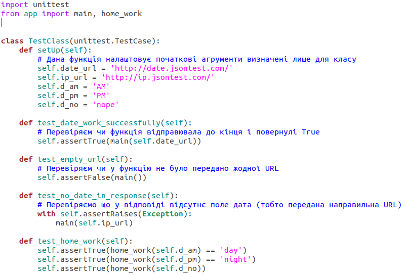

# Лабораторна робота №2
##### 1. Створив папку Lab_2 з файлом README.md
##### 2. Інсталював pipenv за допомогою пакетного менеджера PIP, створив ізольоване середовище для Python та ознайомився з командою pipenv -h.

##### 3.  Встановив бібліотеки requests та ntplib.

##### 4. Створив файл app.py та скопіював туди код з репозиторію.

##### 5. Переконався, що програма працює правильно.

##### 6. Встановив бібліотеку pytest.
##### 7. Успішно виконав тести.

##### 8. Написав функцію, яка перевіряє АМ і РМ в добі, у випадку AM виводить Good morning!, а при PM-Good evening!.

##### 9. Написав тест, що буде перевіряти правильність виконання моєї функції.

