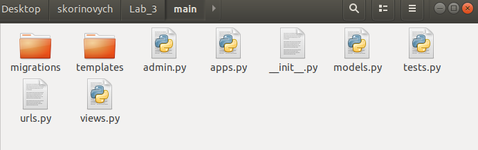

# Лабораторна робота №3
##### 1. Створив папку Lab_3 та ініціалізував середовище pipenv. 

##### 2. За допомогою Djambo Framework створив заготовку мого проекту.
##### 3-4. Запустив сервер та перейшов за посиланням 127.0.0.1:8000

##### 5-6. Створив темплейт main, файл html в папці templates та urls.py в папці main.

