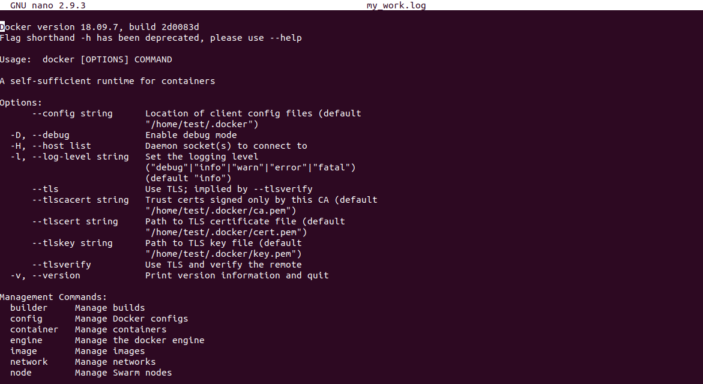
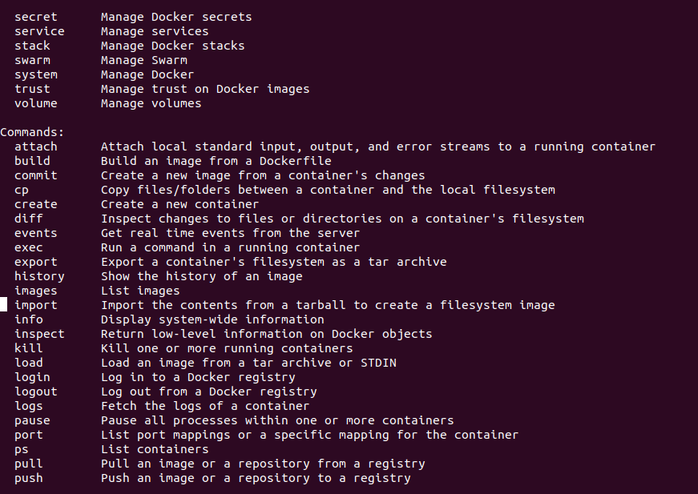
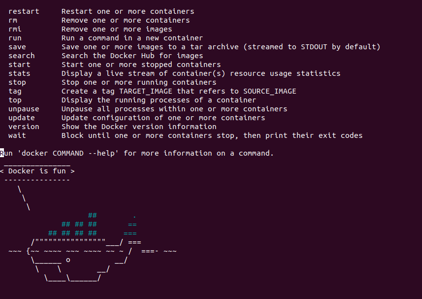
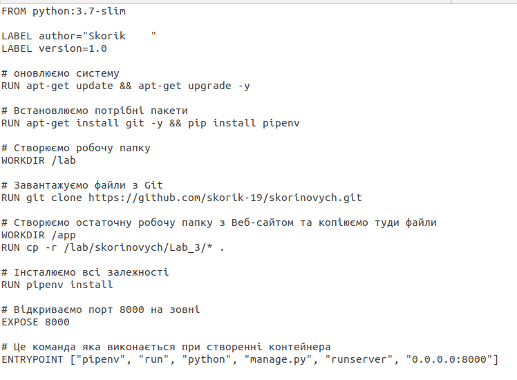

# Лабораторна робота 4
##### 1-2.Перевірив чи працює Docker та перенаправив вивід команд в файл my_work.log .

##### 3-4. Створив Імедж, створив Dockerfile та скопіював туди текст змінивши поcилання.

