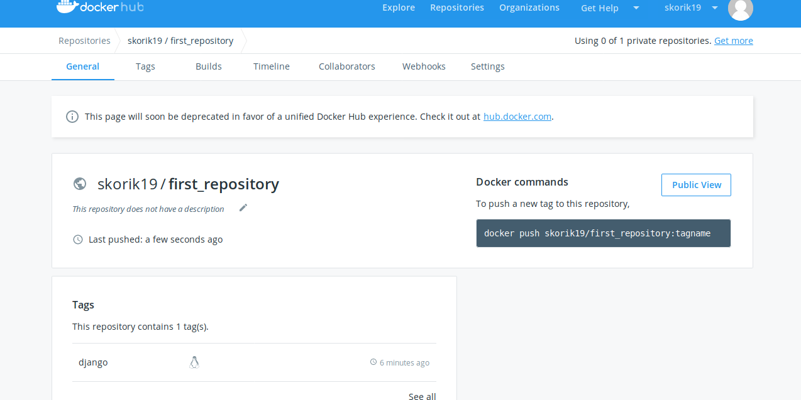
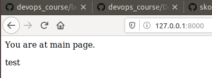

# Лабораторна робота 4
##### 1-2.Перевірив чи працює Docker та перенаправив вивід команд в файл my_work.log .

##### 3-4. Створив Імедж, створив Dockerfile та скопіював туди текст змінивши поcилання.

#####  5-6. Створив власний репозиторій на Docker та виконав білд імеджа.
[посилання на Docker](https://cloud.docker.com/repository/docker/skorik19/first_repository) 

##### 7. Запустив сайт

