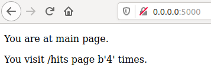
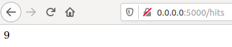
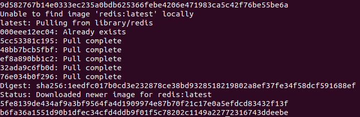
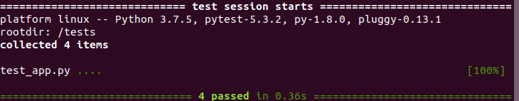
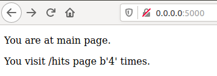
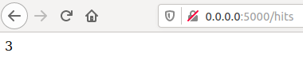
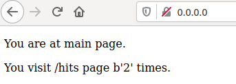
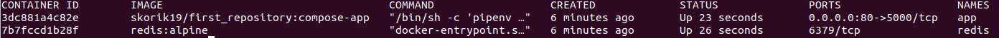

# Лабораторна робота 5

##### 1-4. Почитав про docker-compose та Flask.
##### 5. Створив папки my_app та tests і закинув туди файли.
##### 6. Перевірив чи працює сайт та запустив тести які успішно були пройдені:

##### 7-8. Створив два Dockerfile та Makefile, та заповнив їх.
###### - STATES:= app tests це змінні яким присвоюється значення (динамічно);
###### - REPO:= skorik-19/first_repository це репозиторій на Docker;
###### - .PHONY: $(STATES) це несправжні цілі;
###### - run виконує команди;
###### - docker-prune очищує ресурси.
##### 9. Запустив наступні команди:
###### sudo make app 
###### sudo make tests
###### sudo make run
###### sudo make test-app

#### Браузер:

##### 10-12. Зупинив проект, очистив все та додав директиви в Makefile.
##### 13. Створив docker-compose.yml та заповнив його.
##### 14-15. Запустив docker-compose та переконався що сайт працює (потрібно перейти на адресу 0.0.0.0:80).

##### 16. Переглянув імеджі:

